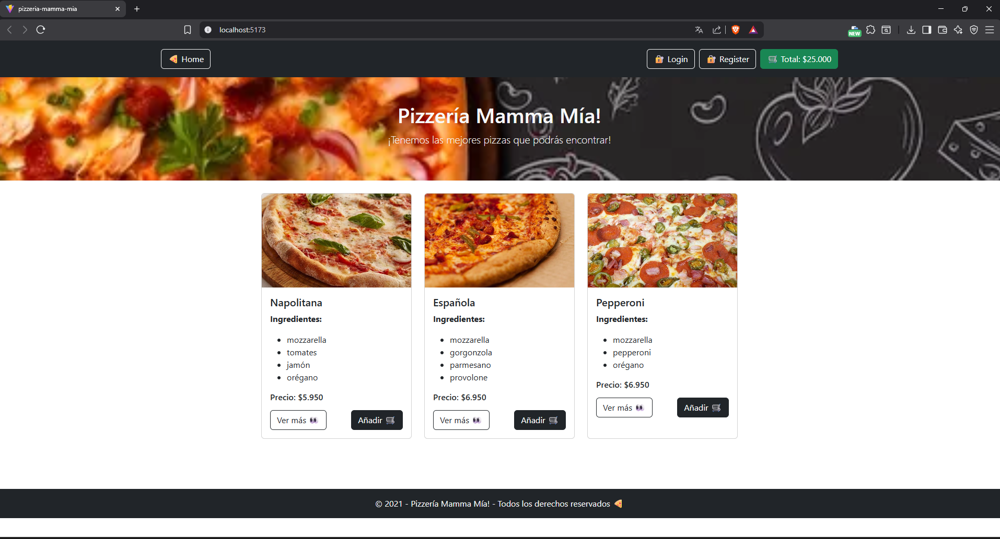

# 🍕 Pizzería Mamma Mía

Proyecto del Hito 1 - Introducción a React (Desafío Latam)

## 🚀 Vista previa

## 💡 Descripción
Aplicación React que muestra un menú de pizzas con componentes reutilizables.
Incluye Navbar, Header, Cards y Footer.  

## ⚙️ Hito 2 - Estados y Eventos en React
En esta etapa se implementaron los **formularios de Registro y Login**, manejando el **estado (`useState`)** y los **eventos (`onChange`, `onSubmit`)**.

**Funciones agregadas:**
- Validaciones de campos obligatorios.  
- Contraseñas con mínimo 6 caracteres.  
- Confirmación de contraseña igual a la original.  
- Mensajes dinámicos de error o éxito.  

---

## 💻 Tecnologías utilizadas
- React  
- JavaScript (ES6+)  
- CSS / Bootstrap  

---

---

## 🍕 Hito 3 - Renderización dinámica de componentes
Se implementó la carga dinámica de pizzas desde el archivo `pizzas.js`, 
utilizando `.map()` para renderizar componentes en `Home.jsx` y `CardPizza.jsx`.

Además, se creó un carrito de compras (`Cart.jsx`) que permite:
- Aumentar y disminuir la cantidad de productos.
- Eliminar pizzas al llegar a 0 unidades.
- Calcular automáticamente el total del pedido.

## 🌐 Hito 4 – Consumo de API externa

En este hito la aplicación dejó de usar datos locales y comenzó a consumir una **API real** desde un backend propio.

### ✔️ Cambios realizados
- Se levantó el backend en `http://localhost:5000`.
- Se consumió el endpoint **GET /api/pizzas** desde `Home.jsx` usando `fetch` y `useEffect`.
- Se reemplazó el archivo de datos local `pizzas.js` por la información entregada por la API.
- Se creó el componente `Pizza.jsx` que consume **GET /api/pizzas/p001** y muestra:
  - Nombre  
  - Imagen  
  - Precio  
  - Ingredientes  
  - Descripción

El botón “Añadir al carrito” aún no tiene funcionalidad, tal como indica este hito.

## 🧑‍💻 Autor
**Medardo Enrique Sanchez Sequera**

